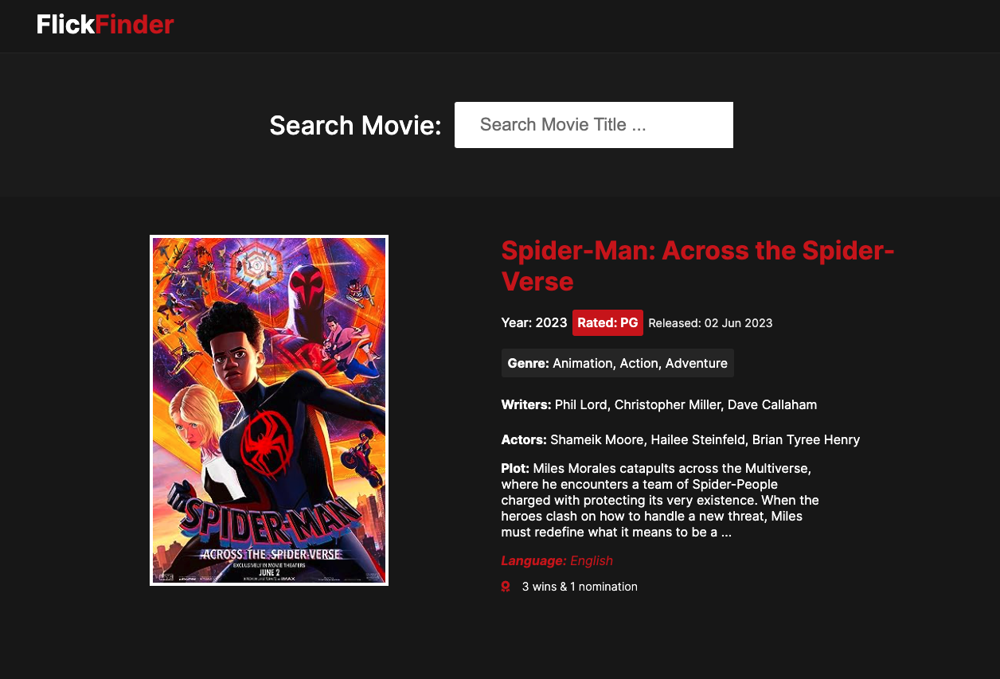

	

  <h1 align="center">Flick Finder</h1>

  

		<h3>
			<a href="https://globoivic.github.io/Flick-Finder/">
				Demo
			</a>
			 | 
			<a href="https://github.com/GloBoiVic/Flick-Finder">
				Github Repo
			</a>
		</h3>
	

### :page_facing_up: About The Project

Using OMDP's API, users can search up any movie and get a detailed page description of the movie queried

- I learned how to fetch data using JavaScript's fetch API
- How to inject and display that data dynamically on the page
- I also utilized some advanced DOM manipulation techniques

### :computer: Built With

- ![HTML][HTML-shield]
- ![CSS][CSS-shield]
- ![JavaScript][JavaScript-shield]

### :bust_in_silhouette: Contact

- [LinkedIn](https://www.linkedin.com/in/developing-vic/) - please reach out to me! I want to connect with other developers!

<!-- MARKDOWN LINKS & IMAGES -->

[html-shield]: https://img.shields.io/badge/HTML5-E34F26?style=for-the-badge&logo=html5&logoColor=white
[CSS-shield]: https://img.shields.io/badge/CSS3-1572B6?style=for-the-badge&logo=css3&logoColor=white
[JavaScript-shield]: https://img.shields.io/badge/JavaScript-F7DF1E?style=for-the-badge&logo=javascript&logoColor=black
